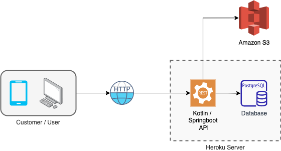

# Restaurant API
#### This application was created in order to apply the knowledge acquired during my personal studies of Kotlin and AWS S3.
#### The main challenge of this API was to deploy the application into the Heroku server, configuring their PostgreSQL add-on to store the data AND store and retrieve images from AWS S3.   
#### The Restaurant API allows the customer to Create and Save restaurants, as well as retrieve them from the database.

## Technologies Used
#### Kotlin, Spring boot, Docker, Flyway, PostgreSQL, AWS S3, Heroku

## Application Architecture


## Sequence diagram

## Run the application locally
#### 1 - run ```docker-compose up -d```
#### 2 - create a ````.env```` file and provide the application with the required envs to connect to the database AND the S3 bucket (I'll soon use Spring Profiles to simplify this configuration)
### Swagger url: http://localhost:8080/swagger-ui/

## Postman Collection with Envs (local and prod)