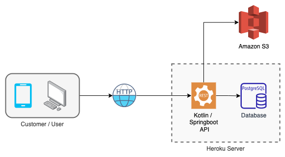

# Restaurant API
### The Restaurant API allows the customer to Create and Save restaurants, as well as retrieve them from the database.
#### This application was created in order to apply the knowledge acquired during my personal studies of Kotlin and AWS S3.
#### The main challenge of this API was to deploy the application into the Heroku server, configuring their PostgreSQL add-on to store the data AND store and retrieve images from AWS S3.   
<hr>

## Technologies Used
- Kotlin
- Springboot
- Docker
- Flyway
- PostgreSQL
- AWS S3
- Heroku
<hr>

## Application Architecture

<hr>

## Run the application locally
#### 1 - run ```docker-compose up -d```
#### 2 - create a ````.env```` file and provide the application with the required envs to connect to the database AND the S3 bucket (I'll soon use Spring Profiles to simplify this configuration)
### Swagger local: http://localhost:8080/swagger-ui/
<hr>

## Test the application on Heroku
#### There is basically 3 endpoints you can access, as described below:
- GET ````https://restaurant-kotlin.herokuapp.com/v1/restaurantes````:
##### Return a list of all restaurants
<hr>

- GET ````https://restaurant-kotlin.herokuapp.com/v1/restaurantes/{id}````:
##### Return a specific restaurant given the 'id' path parameter
<hr>

- POST ````https://restaurant-kotlin.herokuapp.com/v1/restaurantes````:
##### Create a new restaurant
<hr>

## "Create new restaurant" Sequence diagram
#### Since this is the main challenge of the API, I'm providing a simplified sequence diagram to illustrate the exact workflow.


## Postman Collection with Envs (local and prod)